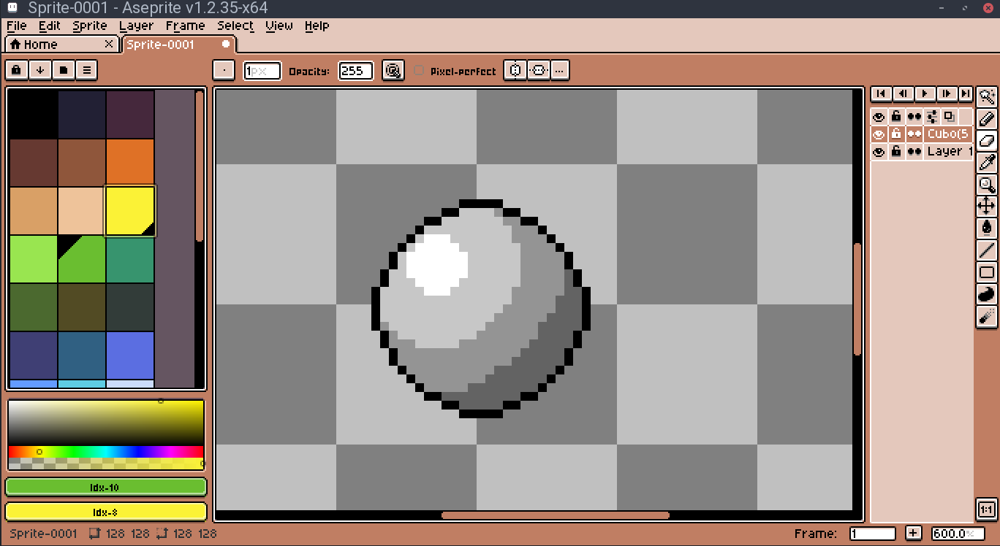

# Cappuccino Aseprite Theme

|  |
| ------ |

## Linux Setup

- Copy files to ~/.config/aseprite/extensions/ 
- Open Aseprite
- Go to Edit/Preferences.
- Select Theme category in the left column.
- Restart Aseprite to make the change happen.